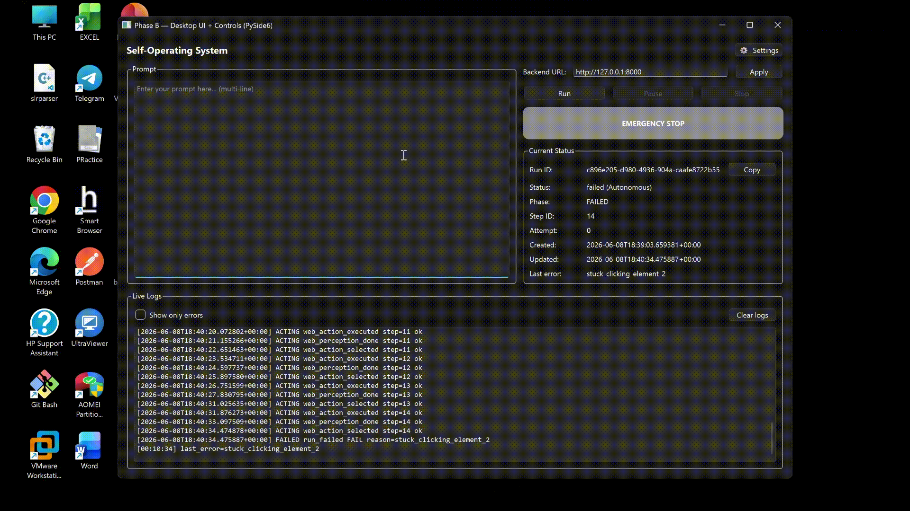
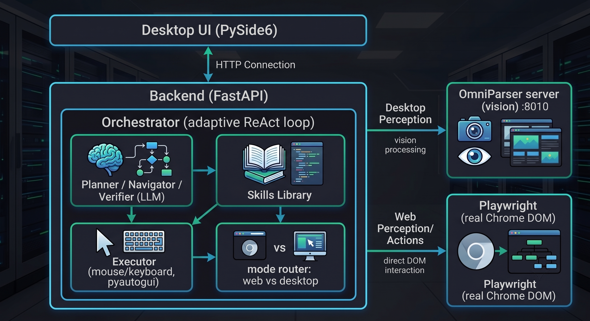

<h1>🤖 Autonomous AI Agent for Windows</h1>
<p><b>An open-source AI agent that operates your entire PC — apps and the web — from a single prompt.</b></p>
It works on <b>both the desktop and the web</b> and decides which to use on its own.

---

## 🎬 Demo

<p align="center">
  
</p>

---

## ✨ Features

- **Vision + DOM hybrid** — Microsoft **OmniParser** (vision) for native Windows apps, and **Playwright** (real browser DOM) for websites — chosen automatically per task.
- **Adaptive agent loop** — perceive → decide → act → verify → adapt; handles popups, profile pickers, and loading screens on its own.
- **Set-of-Mark grounding** — numbered on-screen elements so clicks land precisely.
- **Human-in-the-loop** — pauses and asks you for OTPs, passwords, or confirmation; never enters secrets itself.
- **Multi-provider LLMs** — OpenAI, Google Gemini, or local Ollama; set a different provider/model per agent in the in-app **Settings**.
- **Skills library** — reliable keyboard-first shortcuts (open apps via Windows Search, navigate URLs, etc.).
- **Safety first** — denylist for dangerous commands (cmd, powershell, regedit, …) and an emergency stop hotkey.

---

## 🧱 Architecture

<p align="center">
  
</p>

---

## ⚡ Performance & Speed

**Web tasks are fast on any machine** — they use the browser DOM, with no vision models.

**Desktop tasks** use the OmniParser vision models. In the default setup these run on the **CPU**, so each screen analysis takes a few seconds up to ~a minute depending on your CPU and RAM. (Loading the models on first start also takes ~30s–2min.)

>**The demo above was recorded on:** NVIDIA GeForce RTX 4060 Laptop GPU (8 GB) · Windows 11<br>
>The default install runs the vision models on **CPU**, so this is CPU-speed <br>
> Enabling CUDA (see the GPU tip below) makes it significantly faster. Your speed scales with your hardware.


**Tips to make it faster:**
- **Prefer web tasks** when possible — they don't use the vision models at all.
- **Lighten perception** — in `backend/app/perception/perceptor.py` set `run_caption=False`, `max_side=1280`, `icon_size=640`. This skips the heavy Florence-2 captioning and uses a smaller image (much faster + less RAM; the Navigator still sees the full screenshot).
- **More RAM helps a lot** — loading the models when RAM is tight causes disk swapping.
- **Use a GPU (optional)** — the default install uses CPU PyTorch. If you have an NVIDIA GPU, installing CUDA PyTorch in `env_omniparser` speeds vision up dramatically.

---

## 🚀 Setup (one time)

**Requirements:** Windows 10/11 and Google Chrome. **You do NOT need Python** — the setup downloads its own. (Git is only needed if you clone instead of downloading the ZIP.)

1. **Get the repo** — *Code → Download ZIP* and extract, or:
   ```bash
   git clone https://github.com/Soham-bansal/Autonomous-AI-Agent-For-Windows.git
   ```
2. **Double-click `setup.bat`.** It automatically:
   - downloads a **self-contained Python 3.10** into `python310\` (works the same on any machine — even if you have Python 3.12 installed)
   - creates the `env_operating\` (app) and `env_omniparser\` (perception) environments
   - installs all dependencies (pinned to known-good versions)
   - downloads the ~1 GB OmniParser model weights

   The OmniParser perception code is **bundled** in this repo, so only the weights download. It's a complete sandbox — everything lives inside the project folder.
   Takes ~5–15 minutes depending on your connection.

3. **Add your API key** — start the app, click **⚙ Settings**, paste your OpenAI and/or Gemini key, and pick a provider/model per agent.

---

## ▶️ Run

**Double-click `run.bat`.** It:
1. starts the OmniParser perception server **hidden** (waits until its models load)
2. starts the backend **hidden** (waits until it's ready)
3. opens the **desktop UI** — the only window you see

The servers run in the background (output → `logs\omni_server.log`, `logs\backend.log`). Closing the UI stops them automatically.

Type a task, click **Run**, and watch it work. The agent minimizes the UI so it can see the screen, and restores it when done or when it needs your input.

---

## 🔑 LLM providers

Configure per agent in **⚙ Settings**:

| Provider | Get a key | Suggested models |
|----------|-----------|------------------|
| **OpenAI** | platform.openai.com | `gpt-4o` (navigator), `gpt-4.1-mini` (planner/verifier) |
| **Gemini** (free tier) | aistudio.google.com/apikey | `gemini-2.5-flash` |
| **Ollama** (local, free) | ollama.com | vision: `llama3.2-vision` · text: `llama3.1` |

> The **Navigator needs a vision model**; the Planner/Verifier can use cheaper text models.

---

## 🧩 How it works

| Stage | What it does |
|-------|-------------|
| **Router** | Decides web vs desktop (vs both) for the task |
| **Planner** | Breaks the task into a loose plan |
| **Perception** | OmniParser (vision) for desktop · Playwright DOM for web |
| **Navigator** | Picks the next action from the screen/DOM |
| **Executor** | Performs the click / type / scroll / hotkey |
| **Verifier** | Checks progress, adapts, and asks you when needed |

---

## 🛠️ Folders created by setup (git-ignored)

- `python310\`, `env_operating\`, `env_omniparser\` — the sandboxed Python + environments
- `OmniParser\weights\` — the ~1 GB models
- `agent_chrome_profile\` — the agent's dedicated Chrome profile
- `logs\`, `debug\` — run logs and perception artifacts
- `.env` — your keys/settings (never committed)

---

## ⚠️ Notes & limitations

- The agent uses your **real Chrome** (a dedicated profile) for web tasks — log into sites once in that profile and it persists.
- Heavily bot-protected sites may limit some browser actions.
- It controls your **real mouse and keyboard** — supervise it, and keep the emergency stop ready (**`Ctrl+Shift+Q`**).

---

## 🤝 Contributing

Issues and PRs are welcome! If you find this useful, please ⭐ **star the repo** — it really helps and keeps the project moving.

## 📄 License

MIT — see [LICENSE](LICENSE).


<br>
<br>

<p align="center">
  
  
  
  
  
</p>
